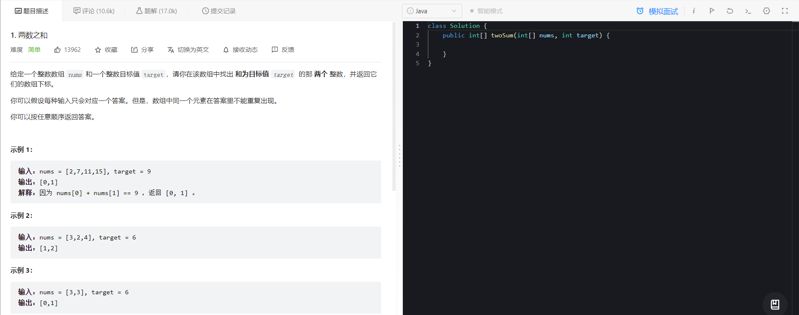
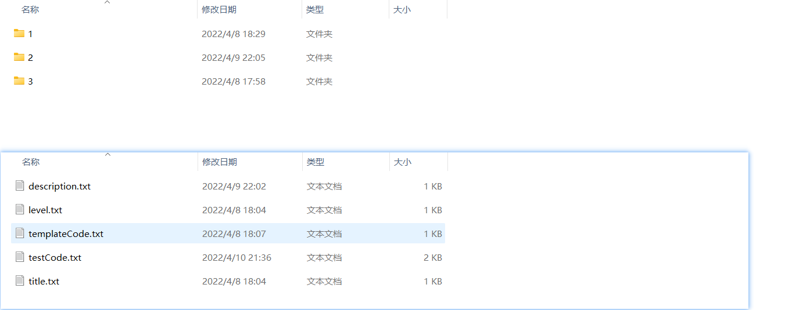

# 项目介绍

## 背景介绍

算法是程序设计中不可缺少的一部分，不少从业者都需要学习算法，国际上最知名的算法刷题平台是力扣，本项目将仿造力扣实现在线编程判断正误。

## 项目模块


打开力扣发现里面有很多的功能，学习、编程、面试应有尽有。

本项目是为了实现力扣的核心功能，所以需要从下面几个地方进行分析

**管理题目**：保存很多题目信息（后端：对数据库的操作）

**题目列表**：展示题目列表（前端：接受后端来的字符串进行操作）

**题目详情**：题目信息+代码编辑框（前端：对前端的字符串进行处理操作）

**提交并运行**：（后端：对前端传来的字符串进行写入文件，编译运行操作）

**查看运行结果**（前端）

# 功能分析

## 题目管理

分析：

这个项目是一个在线OJ系统，那么就需要仿造当前最知名的OJ平台LeetCode

打开力扣题目界面


我们可以看见，显示很多题目,包含的主要信息是，题目序号，题目名字，题目难度

点击某个题目时，查看详情。



显示的主要是信息是：题目的描述，以及部分测试样例，在右边有一个代码编辑框。

对于一个完成的题目而言，它需要有

```sql
create table problem(
    id int primary key auto_increment, --  自增主键
    title varchar(50) not null,        --  题目名字
	level varchar(50) not null,        --  题目难度
    description varchar(4096) not null,--  题目描述
    templateCode varchar(4096) not null,-- 模板代码
    testCode varchar(4096) not null     -- 测试用例
    )
```

在数据库上面的操作

**新增题目**

由于拿到的前端页面就只有两个，题目整体列表的显示以及显示一个题目的详情。本人不会前端，所有通过读取保存文件的信息来构建一个问题的对象，然后进行操作。

**修改题目**

同时也是通过修改文件的方式，将题目信息重新上传到数据库中。



上述功能不暴漏给普通用户，用于管理员管理题目信息。

**查看题目列表**

在LeetCode中我们看见题目是50条每页，但是我们是小OJ平台，暂时不考虑分页的功能

题目列表的显示信息主要是：id，名字，难度

> 小提示
>
> 后端对数据库的操作应该是选择
>
> ```sql
> select id,title,level from problem;
> ```
>
> 不应该是
>
> ```sql
> select * from problem;
> ```
>
> 因为我们只需要上面三个信息，多查询的描述以及代码接口也会占用带宽，并且会给数据库带来较大的压力

对数据库操作将三个信息加入实体类，然后线性表返回给前端

**查看题目详情**

通过id查看一个题目的具体信息，这时候要查询所有的信息让后分装实体类返回给前端。

## 前后端交互分析

主要是下面三个

### 获取题目列表

力扣中获取题目的方式有两种，一个是按页面查找，50个一页，其次是按照标签或者名字或者ID查找，这里我们只考虑全查找和id查找。

其中全查找就是进入页面

后端使用

```java
public List<Problem> selectAll(){
    //code
}
```

将结果封装成字符串返回

### 获取题目详情

前端需要向后端传入一个合法的id

后端显示一个题目所有信息（除了testCode字段）

### 提交代码到服务器

前端向后端传递的需要有题目的id以及代码

代码格式如下

```java
class Solution {
    public int maxArea(int[] height) {
        int left=0,right=height.length-1;
        int maxWater=0,nowWater,h;
        while(left<right){
            h=height[left]>height[right]?height[right]:height[left];
            nowWater=h*(right-left);
            maxWater=maxWater>nowWater?maxWater:nowWater;
            if(height[left]>height[right]){
                --right;
            }
            else{
                ++left;
            }
        }
        return maxWater;
    }
}
```

那么需要怎么构造完整的代码进行编译执行

这里有一个解决方案

```java
class Solution {
    public int maxArea(int[] height) {
        int left=0,right=height.length-1;
        int maxWater=0,nowWater,h;
        while(left<right){
            h=height[left]>height[right]?height[right]:height[left];
            nowWater=h*(right-left);
            maxWater=maxWater>nowWater?maxWater:nowWater;
            if(height[left]>height[right]){
                --right;
            }
            else{
                ++left;
            }
        }
        return maxWater;
    }
    public static void main(String[] args){
        Solution s=new Solution();
        //base1
        s.maxArea(height1);
        //base2
        s.maxArea(height2);
    }
}
```

这样就构造了一个完整的代码？

如何实现？

我们只需要找到**提交代码最后一个'}'，**然后将main方法嵌入其中，得到最终的代码。

如果没有最后一个}怎么办？那显然是编译错误了，直接返回错误信息

然后将代码交给编译运行模块处理

### 服务器返回运行结果

对编译运行处理得到的编译错误或者结果进行处理返回。

## 编译运行模块

在初学java是通过`javac`编译文件，通过`java`执行文件

比如在文件上建立一个简单的.java文件，并通过命令运行

```java
public class Solution{
    public static void main(String[] args){
        System.out.println("hello word");
    }
}
```

直接在当前文件夹进行编译运行


将文件编译到其他文件，然后指定文件路径进行运行


修改代码为

```java
public class Solution{
    public static void main(String[] args){
        Syste.out.println("hello word");
    }
}
```


修改代码为

```java
public class Solution{
    public static void main(String[] args){
        System.out.println("hello word");
        int a=10/0;
    }
}
```


由上面编译或者执行的反馈信息进行判断程序是否正常。

通过标准输入输出得到`javac`或者`java`得到信息，然后写入文件中进行处理。

我们主要通过

```java
public void run(String cmd,String stdoutFile,String stderrFile){
    Process process = Runtime.getRuntime().exec(cmd);
    //对文件的操作
}
```

执行命令然后得到标准的输入输出反馈

有了对文件的操作，那我们需要文件，文件怎么得到呢？仿造leetcode，我们得到前端来的代码进行生成文件的操作。

需要一个一个实体类来放置代码。不妨叫它问题

```java
public class Question{
    private String code;
    //set和get方法
}
```

同理，也需要一个实例类来返回编译运行信息。编译异常、运行正常、运行异常。如果异常还要返回信息。

```java
public class Answer{
    //错误码
    private int error;
    //错误信息
    private String reason;
    //标准输出结果
    private String stdout;
    //标准错误结果
    private String stderr;
    //set和set方法
}
```

# 测试

当提交的代码为

```java
class Solution {
    public int[] twoSum(int[] nums, int target) {
        Map<Integer, Integer> hashtable = new HashMap<Integer, Integer>();
        for (int i = 0; i < nums.length; ++i) {
            if (hashtable.containsKey(target - nums[i])) {
                return new int[]{hashtable.get(target - nums[i]), i};
            }
            hashtable.put(nums[i], i);
        }
        return new int[0];
    }
}
```

时报错,浏览器提示页面

```
.\tmp\03a49a9e-b943-4c51-bb83-1dea3d07370e\Solution.java:3: ����: �Ҳ�������
        Map hashtable = new HashMap();
        ^
  ����:   �� Map
  �: �� Solution
.\tmp\03a49a9e-b943-4c51-bb83-1dea3d07370e\Solution.java:3: ����: �Ҳ�������
        Map hashtable = new HashMap();
                                              ^
  ����:   �� HashMap
  �: �� Solution
2 ������
```

查看源代码以及文件信息

```java
class Solution {
    public int[] twoSum(int[] nums, int target) {
        Map<Integer, Integer> hashtable = new HashMap<Integer, Integer>();
        for (int i = 0; i < nums.length; ++i) {
            if (hashtable.containsKey(target - nums[i])) {
                return new int[]{hashtable.get(target - nums[i]), i};
            }
            hashtable.put(nums[i], i);
        }
        return new int[0];
    }
    public static void main(String[] args) {
        Solution solution=new Solution();
        int[] num1=new int[]{2,7,11,15};
        int[] ret1=solution.twoSum(num1,9);
        int[] ans1={0,1};
        boolean isTrue1=solution.isSame(ans1,ret1);
        if(isTrue1){
            System.out.println("case1 is Ok");
        }else{
            System.out.println("case1 is failed");
            System.exit(0);
        }
        int[] num2=new int[]{3,2,4};
        int[] ret2=solution.twoSum(num2,6);
        int[] ans2={1,2};
        boolean isTrue2=solution.isSame(ans2,ret2);
        if(isTrue2){
            System.out.println("case2 is Ok");
        }else{
            System.out.println("case2 is failed");
            System.exit(0);
        }
        int[] num3=new int[]{3,3};
        int[] ret3=solution.twoSum(num2,6);
        int[] ans3={1,2};
        boolean isTrue3=solution.isSame(ans3,ret3);
        if(isTrue3){
            System.out.println("case3 is Ok");
        }else{
            System.out.println("case3 is failed");
            System.exit(0);
        }
        System.out.println("All Yes");
    }
    private boolean isSame(int[] arr1,int[] arr2){
        if(arr1.length!=arr2.length){
            return false;
        }
        for(int i=0;i<arr1.length;i++){
            if(arr1[i]!=arr2[i]){
                return false;
            }
        }
        return true;
    }
}
```

发现**没有对包进行导入**

需要一个前缀字符串进行导入一个必要的包，这个在前端可以有解题者自己导入，也可以在后端嵌入时导入

不过考虑到对牛客不能自动导入包的深恶痛绝，这里在后端默认导入一个包

```java
import java.util.*;
```

